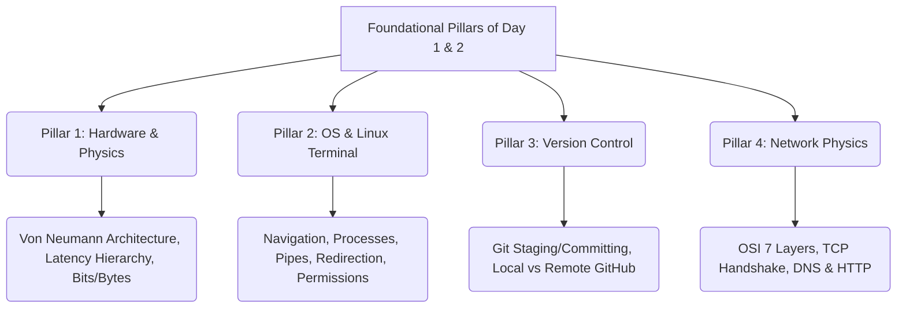

# 🗺️ Unified Day 1–3 Foundation Study Plan
> A synthesized acceleration guide bridging all engineering, systems, database, networking, and programming roadmaps in this workspace.

---

## 🔍 Section 1: Individual Day 1 & Day 2 Plans Across All Roadmaps

Here is a summary of what is scheduled for Day 1 and Day 2 across every roadmap (`.md` file) in your workspace:

### 1. Systems & Architecture Roadmaps
*   **`system design01.md`**
    *   **Day 1:** How Computers Actually Work (Von Neumann Architecture, boot sequence, binary/hex, latency cheat sheet, hand-drawn architecture diagram, set up GitHub).
    *   **Day 2:** CPU Deep Dive & Memory Hierarchy (Fetch-decode-execute, L1/L2/L3 caches, cache hits/misses, clock speed vs cores, hyper-threading, Moore's Law, Python list vs array benchmark).
*   **`system design.md`**
    *   **Day 1:** The OSI Model (7 layers, protocols, mapping real-world behaviors, packet captures using `tcpdump` or Wireshark over Python `http.server`).
    *   **Day 2:** TCP Deep Dive (3-way handshake, socket programming in Python, connection pool vs opening new connections, flow control).
*   **`personal management.md`**
    *   **Day 1:** How a Computer Works (Binary representation, CPU cycles, memory hierarchy, OS layer, write `computer_model.md`).
    *   **Day 2:** Operating System Deep Dive (Directory tree, inodes, process monitoring via `ps`/`top`/`htop`, permissions, environment vars, bash piping).

### 2. Networking & Databases Roadmaps
*   **`computer netwoek.md`**
    *   **Day 1:** The OSI Model (7-layer mapping, Wireshark install, packet layer analysis, Hashnode post).
    *   **Day 2:** Physical Layer Deep Dive (Copper/fiber optic physics, dBm signal measurements, Wi-Fi 2.4/5/6GHz, bandwidth vs latency).
*   **`database.md`**
    *   **Day 1:** How Computers Work (Hardware Foundation: CPU, RAM, HDD/SSD/NVMe latency difference, filesystems like ext4/NTFS).
    *   **Day 2:** Linux Command Line Basics (File ops, process monitoring, permissions, package managers like `apt`, SSH basics).

### 3. Engineering & Project Roadmaps (InfraMesh, PulseGrid, SentinelGrid, MemCore)
*   **`basic roadmap 4 project.md` & `InfraMesh _SentinelGrid _PulseGrid _MemCore .md`**
    *   **Day 1:** How the Internet Works (DNS resolution, IP address lookup, TCP handshake, HTTP request/response cycle, DevTools Network tab tracing, curl/dig CLI).
    *   **Day 2:** Load Balancers, Proxies, and Routing (Forward vs reverse proxy, load balancing algorithms, Nginx local reverse proxy setup, health checks).
*   **`data pattern+web tools.md`**
    *   **Day 1:** Linux Terminal (Server navigation, file manipulation, output redirect, logging analysis using `tail -f`).
    *   **Day 2:** Python Foundations (Syntax, data types, lists, dicts, tuples, control flow, scripting a basic system simulator).

### 4. Language & AI Development Roadmaps
*   **`agentic ai.md`**
    *   **Day 1:** Setup + Linux + Git Foundations (WSL2 setup, basic shell navigation, Git mental model and workflow, Hashnode/GitHub setup).
    *   **Day 2:** Python: Data Types, Control Flow, Functions (Explicit philosophy, collection types, control structures, custom functions).
*   **`job hunt rust.md`**
    *   **Go Track:**
        *   **Day 1:** Go setup, variables, basic types, comparing simple syntax to Python.
        *   **Day 2:** Go functions, multiple returns, idiomatic error handling.
    *   **Rust Track:**
        *   **Day 1:** Rust setup, variables, immutability by default, first program.
        *   **Day 2:** Rust data types, arithmetic, integer overflow panics.
*   **`job hunt.md` & `job hunt 0.md`**
    *   **Day 1:** How Computers Work (CPU execution, RAM workbench analogy, SSD cabinet storage, latency comparison).
    *   **Day 2:** Linux Command Line (Pipes, redirection, file permissions, shell variables).

### 5. Embedded Systems & Hardware AI Roadmaps
*   **`embeddedai.md`**
    *   **Day 1:** What a Computer is at the Lowest Level (Binary, transistors, bits/bytes/words, hexadecimal addresses like `0x40021000`).
    *   **Day 2:** Logic Gates (AND, OR, NOT, NAND universality, truth tables, XOR checksums).

---

## ⚡ Section 2: Overlaps & Similarities (The Core Pillars)

By auditing all 22 roadmaps, we find that their first two days focus on **four foundational pillars**:



1.  **Hardware & Physics of Computing:** You cannot write high-performance databases, embedded firmware, or scalable backends without understanding the speed gap between CPU cache (nanoseconds), RAM (100ns), and SSD (100µs).
2.  **OS & Linux Terminal:** Production software (FastAPI, Nginx, PostgreSQL, Docker, Kafka) runs on Linux. The terminal is your primary interface when things break.
3.  **Version Control (Git & GitHub):** Establishing daily commit habits, staging areas, and pushing to public portfolios is the baseline proof-of-work across every roadmap.
4.  **Network Physics:** Web applications, databases, and microservices interact over the network. Understanding DNS, TCP connection handshakes, and port bindings is the ultimate debugging skill.

---

## 📅 Section 3: The Unified Day 1, 2, & 3 Study Plan

This consolidated study plan integrates all topics from the individual files into a single, logical 3-day path.

### 📅 DAY 1: Hardware Foundations, Computer Architecture & Basic Operating Systems
*Focus: Demystifying the physical machine, binary systems, and memory hierarchy.*

#### 🌅 Morning Block: Theory & Concept (2 hrs)
*   **Von Neumann Architecture:** Learn how CPU, RAM, Disk, System Bus, and I/O interface together.
*   **Memory Hierarchy & Latency numbers:** Understand the physical access time differences:
    *   L1/L2/L3 Cache (0.5ns – 30ns)
    *   RAM (100ns)
    *   SSD/NVMe (100µs)
    *   HDD (10ms)
    *   Internet/Network hops (50ms – 150ms)
*   **Low-Level Representation:** Learn binary (base-2), hexadecimal (base-16), bits, bytes, words (32-bit vs 64-bit), and logic gates (AND, OR, NOT, NAND, XOR).
*   **OS Role:** How the OS coordinates hardware resources, isolates processes, and handles files on disk.

#### 🛠️ Afternoon Block: Practical Tasks (2 hrs)
1.  **Setup Dev Environment:** Install WSL2 (Ubuntu) if on Windows. Set up VS Code.
2.  **Draw by Hand:** Sketch a system diagram showing CPU, L1/L2/L3 caches, RAM, SSD/HDD, and NIC connected by the system bus. Write down real-world latency analogies (e.g., L1 cache = reaching into your pocket; SSD = walking to a library; Network = flying to another country).
3.  **Inspect Machine Specs:** Open your Linux terminal and run:
    ```bash
    lscpu
    cat /proc/cpuinfo
    free -h
    df -h
    ```
    Analyze the number of cores, cache sizes, memory capacity, and disk space.
4.  **Hardware Model Essay:** Write a 300-word explanation detailing what happens when you press a key on your keyboard until characters render on the screen. Save it as `computer_model.md`.

---

### 📅 DAY 2: Linux Terminal, Shell Mechanics, and Operating System Internals
*Focus: Master the shell environment, redirection, pipes, process tables, and file configurations.*

#### 🌅 Morning Block: Theory & Concept (2 hrs)
*   **Why CLI over GUI:** CLI is fast, programmable, scriptable, and the only interface available on headless production servers.
*   **Linux Directory Hierarchy:** Understand where things live:
    *   `/etc` (configs), `/var/log` (server logs), `/proc` (live process info), `/tmp` (temp files), `/home` (user profiles).
*   **Pipes and Redirection:** How stdout, stdin, stderr, `>`, `>>`, `2>`, and `|` connect programs to process complex datasets.
*   **Permissions & Management:** Read permissions (`rwx` / 755), users/groups (`chmod`/`chown`), and the process state model (Running, Sleeping, Zombie).

#### 🛠️ Afternoon Block: Practical Tasks (2 hrs)
1.  **Command Practice:** Open your terminal and run these commands to inspect and manipulate:
    ```bash
    pwd && ls -la
    mkdir -p phase-0-survival/logs
    touch phase-0-survival/logs/app.log
    echo "test log entry" >> phase-0-survival/logs/app.log
    ps aux | grep -i init
    top -n 1
    ```
2.  **Pipes and Filters Practice:** Use piping to extract specific data from your operating system logs:
    ```bash
    cat /proc/meminfo | grep -i Mem
    ls -la /var/log | sort -k 5 -h
    ```
3.  **Interactive Wargames:** Work through **OverTheWire Bandit** levels 0 through 10 (https://overthewire.org/wargames/bandit/).
4.  **Bash Scripting:** Write a simple shell script named `backup_system.sh` that lists files, copies them to a directory, and appends a date tag. Set execute permissions: `chmod +x backup_system.sh`.

---

### 📅 DAY 3: Version Control (Git) & Network Physics
*Focus: Code lineage, collaborative engineering, local/remote workflows, and the 7 layers of network traffic.*

#### 🌅 Morning Block: Theory & Concept (2 hrs)
*   **Git Objects & Flow:** Blobs, trees, commits. The transition states: Working Directory ➔ Staging Area ➔ Local Repository ➔ Remote Repository.
*   **Branching Mechanics:** Merge vs Rebase, resolving conflicts, and managing clean histories.
*   **The OSI Model:** Review the 7 layers (Physical ➔ Data Link ➔ Network ➔ Transport ➔ Session ➔ Presentation ➔ Application).
*   **Transport Protocols:** The TCP 3-way handshake (`SYN`, `SYN-ACK`, `ACK`), reliability via sequence numbers and ACKs, flow control (sliding window) vs the fire-and-forget speed of UDP/QUIC.
*   **The Request Cycle:** Step-by-step path of typing a URL, query DNS, opening port 443, and receiving HTTP responses.

#### 🛠️ Afternoon Block: Practical Tasks (2 hrs)
1.  **Git initialization & Setup:**
    *   Set up a GitHub account, add SSH keys to your terminal.
    *   Create a repository `learning-journal` locally:
        ```bash
        git init learning-journal
        cd learning-journal
        echo "# Learning Journal" > README.md
        git add README.md
        git commit -m "docs: initialize learning journal"
        ```
    *   Link to remote GitHub repository and push: `git push -u origin main`.
2.  **Write `.gitignore`:** Learn to exclude sensitive configuration credentials and local directories (e.g. `.env`, `__pycache__/`, `.vscode/`).
3.  **Wireshark/tcpdump Networking Lab:**
    *   Install Wireshark (GUI) or run `tcpdump` in your WSL terminal.
    *   Run a local web server:
        ```bash
        python3 -m http.server 8080 &
        ```
    *   Start a packet capture filtering for `tcp port 8080`.
    *   In a second terminal, execute `curl http://localhost:8080/`.
    *   Analyze the dump: identify the SYN, SYN-ACK, ACK handshake packets, sequence/acknowledgement numbers, and the HTTP request/response payloads.
4.  **Portfolio Push:** Push your Day 1 `computer_model.md` and Day 2 scripts to GitHub using the Git workflow.

---

## 🛠️ Section 4: Programming Tracks (Choose Your Lang for Day 4+)
If your target roadmap prioritizes programming syntax over infrastructure first, here are the Day 1–3 equivalents:

| Day | Python Track (`agentic ai`, `os.md`) | Rust Track (`job hunt rust`) | Go Track (`job hunt rust`) |
| :--- | :--- | :--- | :--- |
| **Day 1** | Python syntax, data types (`int`/`float`/`str`/`bool`), and collection structures (`list`/`dict`/`set`). | Install Rust, build Hello World, learn variables, bindings, and immutability by default. | Install Go, configure workspace paths, run Hello World, variables and basic structures. |
| **Day 2** | Control flow (`if`/`elif`/`else`, `for`/`while` loops), functions, scope, `*args`/`**kwargs`. | System Types, signed/unsigned bounds, arithmetic overflow protection. | Functions, multiple return arguments, and idiomatic error handling. |
| **Day 3** | Object-Oriented Programming (Classes, inheritance, `self`), file I/O, `try/except` blocks. | Control Flow syntax, match expressions, loops. | Control Flow (`for` loops variations, `if`, `switch`). |

---

## 🎯 Section 5: Roadmap Completion Mapping (What is Checked Off)

Completing this unified 3-day plan will fulfill the initial progress requirements for **eleven different roadmaps** simultaneously:

| Roadmap File | Progress Checked Off | Completed Topics |
| :--- | :--- | :--- |
| **`agentic ai.md`** | **Days 1–2** | Environment setup, Linux fundamentals, Git foundations, basic Python structures. |
| **`system design01.md`** | **Days 1–3** | Hardware, CPU deep dive, memory hierarchy, basic Linux OS structure, commands. |
| **`system design.md`** | **Days 1–2** | OSI 7-layer framework, TCP 3-way handshake, python socket scripting, Wireshark. |
| **`personal management.md`** | **Days 1–3** | Computer hardware, OS process monitoring (`htop`), Git repositories. |
| **`computer netwoek.md`** | **Day 1** | OSI model breakdown, Wireshark installation and traffic analysis. |
| **`database.md`** | **Days 1–3** | Hardware latency rules, Linux files/commands, database network port connections. |
| **`basic roadmap 4 project.md`** | **Days 1–3** | DNS resolution, load balancing, proxy configurations, Linux command syntax. |
| **`InfraMesh _SentinelGrid ...md`**| **Days 1–3** | HTTP/DNS mechanisms, reverse proxy load-balancers, local Linux operations. |
| **`os.md`** | **Days 1–2** | Linux navigation, redirect filters, vim config, shell scripting basics. |
| **`embeddedai.md`** | **Day 1** | Low-level hardware architecture, bits, bytes, and memory storage logic. |
| **`job hunt.md` / `job hunt 0.md`** | **Days 1–3** | Von Neumann hardware, Linux command terminals, Git repository pushing. |

> [!TIP]
> Executing this unified 3-day study plan gives you a comprehensive systems and coding base. Instead of repeating basic Linux terminal commands or Git config instructions in 11 different roadmaps, you address them all in one focused burst, establishing a single clean workspace directory to house all of them.
